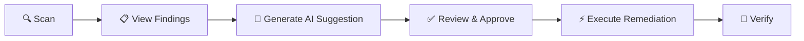

<p align="center">
  
  
  
  
</p>

<h1 align="center">🛡️ SecOps Platform</h1>

<p align="center">
  <strong>Security Orchestration, Automation, and Response (SOAR) for OpenStack</strong>
</p>

<p align="center">
  <em>Automated security scanning • AI-powered remediation • Self-healing infrastructure</em>
</p>

<p align="center">
  <a href="#-features">Features</a> •
  <a href="#-architecture">Architecture</a> •
  <a href="#-quick-start">Quick Start</a> •
  <a href="#-usage">Usage</a> •
  <a href="#-documentation">Documentation</a>
</p>

---

## 📖 Overview

**SecOps Platform** is a comprehensive security automation solution designed for OpenStack cloud environments. It provides:

- 🔍 **Automated Security Scanning**: Continuous detection of misconfigurations across your OpenStack infrastructure
- 🤖 **AI-Powered Remediation**: Intelligent suggestions powered by OpenAI GPT-4
- ⚡ **Automated Response**: Execute approved remediations with YAML-based runbooks
- 📊 **Full Observability**: Complete monitoring stack with Prometheus, Grafana, and Loki

### Why SecOps?

| Challenge | SecOps Solution |
|-----------|-----------------|
| Manual security audits are slow | Automated scans every 5 minutes |
| Remediation requires expertise | AI generates step-by-step fixes |
| No visibility into security posture | Real-time dashboards and metrics |
| Scattered logs and alerts | Centralized logging and alerting |

---

## ✨ Features

### 🔐 Security Scanning

<table>
<tr>
<td width="50%">

**Network Security**
- Security Groups (SSH, RDP, DB ports)
- Floating IP exposure detection
- Port security enforcement

</td>
<td width="50%">

**API Security**
- Endpoint authentication checks
- Missing security headers
- HTTP/HTTPS protocol validation
- Dangerous HTTP methods detection

</td>
</tr>
<tr>
<td>

**OS Security**
- SSH configuration hardening
- Firewall status monitoring
- Security baseline compliance

</td>
<td>

**Resource Monitoring**
- Instance error state detection
- Volume health checks
- Compliance validation

</td>
</tr>
</table>

### 🤖 AI-Powered Remediation

- **Smart Suggestions**: GPT-4 generates detailed remediation steps
- **Contextual Analysis**: Understands your infrastructure context
- **Approval Workflow**: Human-in-the-loop for critical changes
- **Runbook Integration**: Execute fixes via YAML-based runbooks

### 📊 Observability Stack

| Component | Port | Purpose |
|-----------|------|---------|
| **Grafana** | 3000 | Visualization & Dashboards |
| **Prometheus** | 9090 | Metrics Collection & Storage |
| **Loki** | 3100 | Log Aggregation |
| **Alertmanager** | 9093 | Alert Management |

---

## 🏗️ Architecture

### System Overview

```
┌─────────────────────────────────────────────────────────────────┐
│                         OpenStack Cloud                          │
│                                                                   │
│  ┌─────────────────────────────────────────────────────────────┐ │
│  │                  Tenant Network: 10.10.50.0/24               │ │
│  │                                                               │ │
│  │  ┌─────────────────┐  ┌─────────────────┐  ┌──────────────┐ │ │
│  │  │   🌐 Gateway    │  │  🛡️ SecOps App  │  │  🖥️ Workload │ │ │
│  │  │  (obs_stack)    │  │                  │  │              │ │ │
│  │  │                 │  │                  │  │              │ │ │
│  │  │  • Grafana      │  │  • REST API      │  │  • Demo      │ │ │
│  │  │  • Prometheus   │  │  • Scanners      │  │    Misconfig │ │ │
│  │  │  • Loki         │  │  • AI Service    │  │              │ │ │
│  │  │  • AlertManager │  │  • Scheduler     │  │              │ │ │
│  │  │                 │  │                  │  │              │ │ │
│  │  │  📍 10.10.50.60 │  │  📍 10.10.50.163 │  │ 📍10.10.50.233│ │ │
│  │  │  🌍 Floating IP │  │                  │  │              │ │ │
│  │  └─────────────────┘  └─────────────────┘  └──────────────┘ │ │
│  │           │                    │                  │          │ │
│  │           └────────────────────┴──────────────────┘          │ │
│  └───────────────────────────────────────────────────────────────┘ │
│                                │                                   │
│  ┌────────────────────────────┴────────────────────────────────┐  │
│  │              Router (Gateway: 10.10.50.1)                    │  │
│  └──────────────────────────┬───────────────────────────────────┘  │
│                              │                                      │
└──────────────────────────────┼──────────────────────────────────────┘
                               │
                      🌐 External Network
```

### Data Flow

```
┌──────────────────┐     Scan      ┌──────────────────────────────────────┐
│   OpenStack      │ ────────────► │           SecOps App                  │
│   Resources      │   (every 5m)  │  ┌────────────────────────────────┐  │
└──────────────────┘               │  │  Scanners:                     │  │
                                   │  │  • Security Groups             │  │
                                   │  │  • API Endpoints               │  │
                                   │  │  • OS Baseline                 │  │
                                   │  └────────────┬───────────────────┘  │
                                   │               │                       │
                                   │  ┌────────────▼───────────────────┐  │
                                   │  │  AI Service (OpenAI GPT-4)     │  │
                                   │  │  → Generate Remediation        │  │
                                   │  └────────────┬───────────────────┘  │
                                   │               │                       │
                                   │  ┌────────────▼───────────────────┐  │
                                   │  │  SQLite Database               │  │
                                   │  │  • Findings                    │  │
                                   │  │  • Suggestions                 │  │
                                   │  │  • Remediation Runs            │  │
                                   │  └────────────────────────────────┘  │
                                   └───────────────┬───────────────────────┘
                                                   │
            ┌──────────────────────────────────────┴────────────────────┐
            │                                                            │
    ┌───────▼────────┐                                      ┌────────────▼───────┐
    │  Prometheus    │                                      │      Loki          │
    │  (Metrics)     │                                      │      (Logs)        │
    └───────┬────────┘                                      └────────────┬───────┘
            │                                                            │
            └──────────────────────┬─────────────────────────────────────┘
                                   │
                          ┌────────▼────────┐
                          │    Grafana       │
                          │  📊 Dashboards   │
                          │  🔔 Alerts       │
                          │  📜 Log Viewer   │
                          └──────────────────┘
```

### Technology Stack

| Layer | Technologies |
|-------|--------------|
| **Infrastructure** | Terraform, OpenStack |
| **Configuration** | Ansible |
| **Backend** | Python 3.8+, FastAPI, OpenStack SDK |
| **AI** | OpenAI GPT-4 |
| **Database** | SQLite |
| **Monitoring** | Prometheus, Grafana, Loki, Promtail |
| **Containers** | Docker, Docker Compose |

---

## 📋 Prerequisites

### Required Software

| Tool | Version | Purpose |
|------|---------|---------|
| Terraform | >= 1.3.0 | Infrastructure provisioning |
| Ansible | >= 2.9 | Configuration management |
| OpenStack CLI | Latest | Cloud management |
| Python | >= 3.8 | Runtime |
| Docker | Latest | Containerization |
| jq | Latest | JSON parsing |

### OpenStack Requirements

- ✅ Access to OpenStack cloud with `clouds.yaml` configured
- ✅ Ubuntu 22.04 image available in Glance
- ✅ SSH keypair created
- ✅ External network available (e.g., `public1`)
- ✅ Required flavors:
  - `flavor-secops-app` (2 vCPU, 4GB RAM)
  - `flavor-obs-stack` (2 vCPU, 4GB RAM)
  - `flavor-workload` (1 vCPU, 2GB RAM)
- ✅ Quota: 4 VMs, 3 volumes (20GB each), 2+ floating IPs

### Optional

- 🔑 **OpenAI API Key** - For AI-powered suggestions
- 🌐 **Domain name** - For production HTTPS access

---

## 🚀 Quick Start

### Step 1: Clone Repository

```bash
git clone <repository-url>
cd secops-misconfig-detection-and-remediation
```

### Step 2: Configure Credentials

> ⚠️ **Important**: This repository uses `.example` files for sensitive configurations. Never commit actual credentials to git!

```bash
# 1. Configure OpenStack credentials for SecOps App
cp ansible/files/tenantA-openrc.sh.example ansible/files/tenantA-openrc.sh
nano ansible/files/tenantA-openrc.sh  # Add your credentials

# 2. Configure Terraform variables
cp terraform/terraform.tfvars.example terraform/terraform.tfvars
nano terraform/terraform.tfvars  # Configure your settings
```

<details>
<summary>📄 Example terraform.tfvars configuration</summary>

```hcl
openstack_cloud         = "kolla"              # Name from clouds.yaml
image_name              = "Ubuntu-22.04"       # Your image name
keypair_name            = "your-keypair"       # Your SSH keypair
admin_cidr              = "YOUR_IP/32"         # Your public IP for access
ssh_private_key_path    = "/path/to/your/key"  # Path to SSH private key

flavors = {
  secops_app = "flavor-secops-app"
  obs_stack  = "flavor-obs-stack"
  gateway    = "flavor-workload"
  private_vm = "flavor-workload"
}
```

</details>

### Step 3: Deploy Infrastructure

```bash
cd terraform/

# Initialize Terraform
terraform init

# Review the deployment plan
terraform plan

# Deploy infrastructure
terraform apply
```

### Step 4: Deploy Services

```bash
cd ../ansible/

# Run all playbooks in sequence
ansible-playbook -i inventory.ini \
  00-mount-data.yml \
  01-docker.yml \
  02-obs-stack.yml \
  03-agents.yml \
  04-secops-app.yml \
  05-gateway-routing.yml
```

### Step 5: Access the Platform

| Service | URL | Credentials |
|---------|-----|-------------|
| **Grafana** | `http://<floating-ip>:3000` | admin / admin |
| **Prometheus** | `http://<floating-ip>:9090` | - |
| **SecOps API** | `http://<secops-app-ip>:8000` | - |

```bash
# Get floating IP
cd terraform && terraform output obs_stack_floating_ip
```

📚 For detailed setup instructions, see [SETUP.md](SETUP.md).

---

## 💻 Usage

### CLI Commands

Access the SecOps CLI inside the container:

```bash
# SSH into SecOps App container
docker exec -it secops-secops-app-1 bash

# Available commands:
secops-cli findings list              # List all findings
secops-cli findings list --severity HIGH  # Filter by severity
secops-cli findings show <id>         # View finding details

secops-cli scan                       # Trigger manual scan

secops-cli suggestions generate <id>  # Generate AI suggestion
secops-cli suggestions list           # List all suggestions
secops-cli suggestions approve <id>   # Approve a suggestion

secops-cli remediate run <id>         # Execute remediation
secops-cli remediate show <id>        # View remediation status

secops-cli stats                      # View statistics
```

### REST API

```bash
# Create SSH tunnel to access API
ssh -L 8000:10.10.50.237:8000 ubuntu@<gateway-floating-ip>

# API Endpoints
curl http://localhost:8000/api/findings      # List findings
curl http://localhost:8000/api/services      # List services
curl -X POST http://localhost:8000/api/scan  # Trigger scan
curl http://localhost:8000/api/suggestions   # List suggestions
```

### Typical Workflow



```bash
# 1. Scan for issues
secops-cli scan

# 2. View high severity findings
secops-cli findings list --severity HIGH

# 3. Generate AI suggestion for a finding
secops-cli suggestions generate <finding-id>

# 4. Review the suggestion
secops-cli suggestions show <suggestion-id>

# 5. Approve if acceptable
secops-cli suggestions approve <suggestion-id>

# 6. Execute remediation
secops-cli remediate run <finding-id>

# 7. Verify the result
secops-cli remediate show <run-id>
```

---

## 🔍 Finding Types

### Network Security (HIGH Severity)

| Type | Description |
|------|-------------|
| `SG_WORLD_OPEN_SSH` | SSH (tcp/22) accessible from 0.0.0.0/0 |
| `SG_WORLD_OPEN_RDP` | RDP (tcp/3389) accessible from 0.0.0.0/0 |
| `SG_WORLD_OPEN_DB_PORT` | Database ports accessible from 0.0.0.0/0 |
| `FIP_EXPOSED_INSTANCE` | Instance has floating IP attached |
| `PORT_SECURITY_DISABLED` | Neutron port has port security disabled |

### API Security (HIGH/MEDIUM)

| Type | Severity | Description |
|------|----------|-------------|
| `API_INSECURE_PROTOCOL` | HIGH | API uses HTTP instead of HTTPS |
| `API_UNAUTHENTICATED_ACCESS` | HIGH | API accessible without authentication |
| `API_MISSING_SECURITY_HEADERS` | MEDIUM | Missing X-Frame-Options, X-Content-Type-Options |
| `API_VERSION_DISCLOSURE` | LOW | Server headers expose version information |
| `API_DANGEROUS_METHODS` | MEDIUM | TRACE or TRACK methods allowed |

### OS Security (HIGH/MEDIUM)

| Type | Severity | Description |
|------|----------|-------------|
| `OS_SSH_PASSWORD_AUTH_ENABLED` | HIGH | SSH password authentication enabled |
| `OS_SSH_ROOT_LOGIN_ENABLED` | HIGH | SSH root login permitted |
| `OS_FIREWALL_DISABLED` | MEDIUM | UFW or firewalld not running |

### Resource Errors (MEDIUM)

| Type | Description |
|------|-------------|
| `INSTANCE_ERROR_STATE` | Instance is in ERROR state |
| `VOLUME_ERROR_STATE` | Volume has error status |

---

## 🛠️ Troubleshooting

<details>
<summary>❌ SSH Connection Refused</summary>

```bash
# Check security groups
openstack security group rule list secops-sg-ssh-admin

# Check instance status
openstack server list

# Verify floating IP
terraform output obs_stack_floating_ip

# Ensure your IP is in admin_cidr
```

</details>

<details>
<summary>❌ Grafana Cannot Connect to Prometheus/Loki</summary>

```bash
# 1. Check services are running
ssh ubuntu@<obs_stack_floating_ip>
cd /opt/obs-stack
docker compose ps

# 2. Test from container
docker exec -it <grafana_container> curl http://prometheus:9090/api/v1/status/config
docker exec -it <grafana_container> curl http://loki:3100/ready

# 3. Check Data Source URLs in Grafana:
# Prometheus: http://prometheus:9090 or http://localhost:9090
# Loki: http://loki:3100 or http://localhost:3100
```

</details>

<details>
<summary>❌ SecOps API Not Scanning</summary>

```bash
# 1. Check OpenStack credentials
docker exec -it secops-secops-app-1 bash
cat /opt/secops/secops_app/openstack.env

# 2. Check logs
docker logs secops-secops-app-1
tail -f /data/secops/secops.log

# 3. Test OpenStack connection
source /opt/secops/tenantA-openrc.sh
openstack server list
```

</details>

<details>
<summary>❌ Terraform Apply Fails</summary>

Common issues:
- **Flavor doesn't exist**: Update flavors in `terraform.tfvars`
- **Image not found**: Check image name in Glance
- **Quota exceeded**: Request quota increase or reduce resources
- **Keypair not found**: Create keypair in OpenStack

</details>

---

## 📚 Documentation

| Document | Description |
|----------|-------------|
| [SETUP.md](SETUP.md) | Detailed setup instructions |
| [ASSET/SYSTEM_ARCHITECTURE.md](ASSET/SYSTEM_ARCHITECTURE.md) | Complete system architecture |
| [ASSET/ARCHITECTURE_DIAGRAMS.md](ASSET/ARCHITECTURE_DIAGRAMS.md) | Visual architecture diagrams |
| [secops_app/DASHBOARD_README.md](secops_app/DASHBOARD_README.md) | Dashboard usage guide |

### External References

- [Terraform OpenStack Provider](https://registry.terraform.io/providers/terraform-provider-openstack/openstack/latest/docs)
- [Ansible Documentation](https://docs.ansible.com/)
- [Grafana Documentation](https://grafana.com/docs/)
- [Prometheus Documentation](https://prometheus.io/docs/)
- [Loki Documentation](https://grafana.com/docs/loki/latest/)
- [OpenStack SDK](https://docs.openstack.org/openstacksdk/)
- [OpenAI API](https://platform.openai.com/docs/)

---

## 🔒 Security Considerations

> **Important**: This repository is configured to exclude sensitive files via `.gitignore`.

### Protected Files

| File Pattern | Description |
|--------------|-------------|
| `*.tfstate` | Terraform state (contains infrastructure details) |
| `*.tfvars` | Terraform variables (may contain sensitive configs) |
| `*-openrc.sh` | OpenStack credentials |
| `*.env` | Environment variables |
| `inventory.ini` | Generated inventory with IPs |

### Best Practices

1. **Never commit credentials** - Always use `.example` files in repository
2. **Restrict admin_cidr** - Use specific IP (`YOUR_IP/32`) instead of broad ranges
3. **Change default passwords** - Update Grafana admin password on first login
4. **Use SSH keys only** - Disable password authentication
5. **Regular updates** - Keep images updated and apply security patches

---

## 🗺️ Roadmap

Future enhancements planned:

- [ ] 🌐 Web dashboard (React/Vue frontend)
- [ ] ☁️ Multi-cloud support (AWS, Azure, GCP)
- [ ] 💬 Slack/Teams integration
- [ ] 🎫 Jira/ServiceNow integration
- [ ] 🔌 Custom scanner plugins
- [ ] 🧠 Machine learning for anomaly detection
- [ ] 📋 Compliance reporting (CIS, PCI-DSS)
- [ ] 👥 Role-based access control (RBAC)

---

## 🗑️ Cleanup

To destroy all infrastructure:

```bash
cd terraform
terraform destroy
```

> ⚠️ **Warning**: This will delete all VMs, volumes, and data. Make sure to backup important data first!

---

## 🤝 Contributing

Contributions are welcome! Please follow these steps:

1. 🍴 Fork the repository
2. 🌿 Create a feature branch (`git checkout -b feature/amazing-feature`)
3. 💻 Make your changes
4. ✅ Test thoroughly
5. 📝 Update documentation
6. 🚀 Submit a pull request

**Guidelines:**
- No sensitive data in commits
- Follow existing code style
- Update documentation for new features

---

## 📝 License

This project is licensed under the MIT License - see the [LICENSE](LICENSE) file for details.

---

## 👥 Authors & Acknowledgments

**SecOps Team**

Special thanks to:
- 🌐 OpenStack community
- 🏗️ Terraform and Ansible communities
- 🤖 OpenAI for GPT-4 API
- 📊 Prometheus, Grafana, and Loki projects

---

## 📞 Support

For issues and questions:

1. 📖 Check [SETUP.md](SETUP.md) for common setup issues
2. 🔍 Review [Troubleshooting](#-troubleshooting) section
3. 🔎 Check existing issues for similar problems
4. 🆕 Open a new issue on GitHub

---

<p align="center">
  <strong>⚠️ Disclaimer</strong>
</p>

<p align="center">
  <em>This is a security automation tool. Always test in non-production environments first.<br/>
  The automated remediation feature should be used with caution and proper approval workflows.</em>
</p>

---

<p align="center">
  Made with ❤️ for OpenStack Security
</p>
